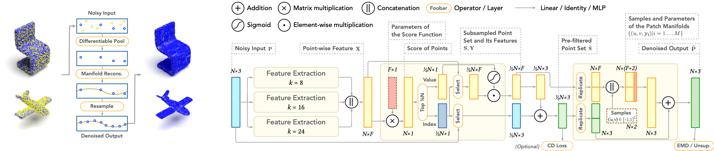

# DMRDenoise



[[Project Page](https://luost.me/DMRDenoise/)] [[Paper](https://arxiv.org/abs/2007.13551)] [[Code](https://github.com/luost26/DMRDenoise)]

This is an implementation of the DMRDenoise model based on our paper "Differentiable Manifold Reconstruction for Point Cloud Denoising", which will appear in ACM MM 2020.

## :loudspeaker: News

- **[Aug 15, 2021]** Please check out our latest work on point cloud denoising: *Score-Based Point Cloud Denoising* (ICCV 2021) [[Paper](https://arxiv.org/abs/2107.10981)] [[Code](https://github.com/luost26/score-denoise)].


## Installation

### Recommended Environment

The code has been tested with the following environment:

| Package                | Version |
| ---------------------- | ------- |
| PyTorch                | 1.5.1   |
| CUDA and NVCC Compiler | 10.0    |
| scikit-learn           | 0.23.1  |
| h5py                   | 2.10.0  |
| PyTorch Lightning      | 0.7.6   |

### Install via Conda

We provide a yaml file that allows instantaneous environment setup. Run the following command and it will create a conda environment named `DMRDenoise` with all required packages installed:

```bash
conda env create -f environment.yml
conda activate DMRDenoise
```

Next, compile the EMD operator. Note that this step requires CUDA NVCC compiler:

```bash
cd ./ops/emd
python setup.py install
```

### Install Manually

You may also set up the environment manually. We provide the instruction as follows:

```bash
# Create a conda environment
conda create --name DMRDenoise python=3.6
conda activate DMRDenoise
# Install required packages
conda install -y pytorch=1.5.1 torchvision=0.6.1 cudatoolkit=9.2 -c pytorch
conda install -y scikit-learn=0.23.1
conda install -y -c conda-forge h5py=2.10.0 pytorch-lightning=0.7.6
# Compile the EMD operator
# [NOTICE] This step requires CUDA NVCC compiler
cd ./ops/emd; python setup.py install; cd ../../
```

### Dataset

The training and testing datasets can be downloaded [here](https://drive.google.com/drive/folders/1Qw_bYqsUcekeh165kgRODwIuYpsYIzM1?usp=sharing). Extract the two zip files into the `data` folder to use them.


## Usage

### Denoise

We provide two pretrained models in the `pretrained` folder. You may use the models to denoise your point clouds:

```bash
python denoise.py --input <input_xyz> --output <output_xyz> --ckpt ./pretrained/supervised/epoch=153.ckpt
```

If you have downloaded the datasets, you may barely run `python denoise.py` to see a quick example.

### Train

Before training the model on your own, please make sure the training dataset is prepared.

Supervised training:

```bash
python train.py
```

Unsupervised training:

```bash
python train.py --loss_ds None --loss_rec unsupervised
```

We provide TensorBoard logs of our pretrained models for reference. To view the logs, run:

```
tensorboard --logdir ./pretrained
```


## Citation

Please cite our paper if you use this code in your own work:

```
@inproceedings{luo2020differentiable,
  title={Differentiable Manifold Reconstruction for Point Cloud Denoising},
  author={Luo, Shitong and Hu, Wei},
  booktitle={Proceedings of the 28th ACM International Conference on Multimedia},
  year={2020},
  month={October}
}
```

